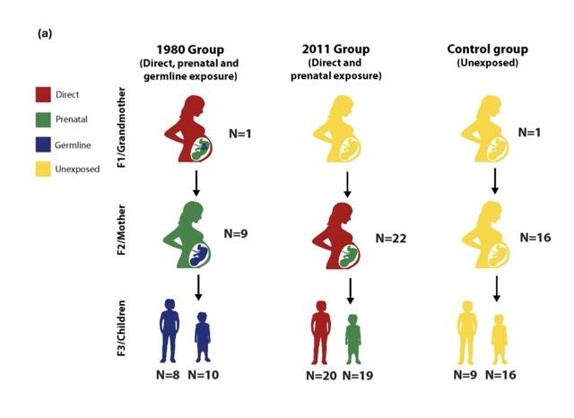

# Syrian Refugee Epigenetic Study - Data Repository



Epigenetic analysis of violence trauma across three generations of Syrian families exposed to armed conflict.

**Original Publication:**

Mulligan CJ, Nusinovici S, Messer LB, et al. Intergenerational epigenetic inheritance of violence trauma in Syrian refugee families. *Sci Rep*. 2025;15:3621. Published 2025 Feb 4.

**PMC**: https://pmc.ncbi.nlm.nih.gov/articles/PMC11868390/


## Study Overview

This repository contains methylation and epigenetic age data from Syrian refugee families with contrasting exposures to violence:
- **1980 Hama Massacre**: Grandmother exposed during pregnancy
- **2011 Syrian Uprising**: Mother exposed during pregnancy
- **Control Group**: Syrian families in Jordan before 1980

**Sample Size**: 131 participants across 48 families (10 from 1980, 22 from 2011, 16 controls)
**Methylation Platform**: Illumina EPIC BeadChip (866K CpG sites)
**GEO Accession**: GSE226085

## Methods Summary

### DNA Collection & Methylation
- **Tissue**: Buccal swab samples
- **Extraction**: Qiagen DNA Investigator Kit / Isohelix Xtreme DNA Isolation Kit
- **Array**: Illumina EPIC BeadChip (Hussman Institute, University of Miami)
- **Processing**: SeSAMe normalization, ComBat batch correction, EpiDISH cell type estimation

### Analysis Approaches
1. **EWAS**: Robust linear regression + GEE with family clustering
2. **Epigenetic Age**: PedBE, Skin & Blood, pan-tissue clocks, PC-Clocks
3. **Quality Control**: 768,625 probes retained after filtering

## Prerequisites

### Install Micromamba

Micromamba is required for managing the R environment and dependencies.

**Quick install:**
```bash
./install_micromamba.sh
```

**Manual installation alternatives:**

**macOS (Homebrew):**
```bash
brew install micromamba
```

**macOS/Linux (official installer):**
```bash
"${SHELL}" <(curl -L https://micro.mamba.pm/install.sh)
```

**After installation, initialize your shell:**
```bash
micromamba shell init --shell bash --root-prefix=~/micromamba
source ~/.bashrc  # or ~/.zshrc for zsh
```

**Verify installation:**
```bash
micromamba --version
```

See [Micromamba documentation](https://mamba.readthedocs.io/en/latest/installation/micromamba-installation.html) for more options.

## Quick Start

### Complete Pipeline

Run the entire 4-stage analysis pipeline:
```bash
# Full analysis (30-40+ hours, 128 GB RAM)
./run_all_stages.sh

# Test mode (quick validation, 2-4 hours, 32-64 GB RAM)
./run_all_stages.sh --test

# Run specific stage only
./run_all_stages.sh --stage 2
```

### Step-by-Step Setup

1. **Download data**
```bash
./download.sh              # Downloads 4 figshare datasets + 320 IDAT files
./download.sh --skip-verify  # Skip file integrity checks (faster)
# Raw ZIPs land in downloads/, IDATs in downloads/idat/
```

2. **Extract and set up directories**
```bash
./extract.sh               # Extracts ZIP archives under data/
./link_data.sh             # Creates directory structure and symlinks
```

3. **Set up R environment**
```bash
./setup_environment.sh     # Creates micromamba env with all packages
source activate_env.sh     # Activate environment
```

4. **Run analysis stages**
```bash
# Stage 1: Quality Control (8-12 hours)
./run_stage1.sh           # Full analysis
./run_stage1.sh --test    # Test with 2 samples (30-60 min)

# Stage 2: EWAS Analysis (12-24 hours)
./run_stage2.sh           # Full analysis
./run_stage2.sh --test    # Test mode (1-2 hours)

# Stage 3: Epigenetic Age QC (8-12 hours)
./run_stage3.sh           # Full analysis
./run_stage3.sh --test    # Test mode (30-60 min)

# Stage 4: Age Acceleration Analysis (2-4 hours)
./run_stage4.sh           # Full analysis
./run_stage4.sh --test    # Test mode (30-60 min)
```

### View Results
```bash
open script/igp_quality_control_20230222.html              # Stage 1 QC
open script/IGP_HiperGator_Code_v24.html                   # Stage 2 EWAS
open script/igp_epigenetic_age_quality_control_20230611.html  # Stage 3 Age QC
open script/igp_epigenetic_age_analysis_v6.html            # Stage 4 Acceleration
```

## Directory Structure

```
data/
├── 22183534/          # Quality Control for EWAS (2.4 GB)
├── 22183384/          # EWAS Analysis (1.8 GB)
├── 23498658/          # Epigenetic Age Analysis (6.7 MB)
├── 23498670/          # Quality Control for Epigenetic Age (2.5 GB)
├── idat/              # Sample raw IDAT files (14 MB)
├── *.zip              # Compressed archives (7.0 GB total)
```

---

## Data Files Documentation

### 1. `data/22183534/` - Quality Control for EWAS

**Purpose**: Methylation data quality control
**Computational Requirements**: 16 cores, 128 GB RAM

#### Source Code
| File | Size | Language | Description |
|------|------|----------|-------------|
| `igp_quality_control_20230222.Rmd` | 108 KB | R Markdown | QC analysis script |

#### Analysis Reports
| File | Size | Description |
|------|------|-------------|
| `igp_quality_control_20230222.html` | 9.8 MB | Main QC report |
| `meffil_qc_summary_report_20211004.html` | 1.4 MB | Meffil package QC summary |

#### Processed Data
| File | Size | Format | Description |
|------|------|--------|-------------|
| `final_igp_data.rds` | 720 MB | RDS | Final processed methylation data |
| `combatBetas.rds` | 871 MB | RDS | ComBat batch-corrected beta values |

#### Sample Metadata

**`cMulligan_SampleManifest160.csv`** (27 KB, 161 rows)
```
Columns: Submitted by, SAMPLE EXTERNAL ID, HIHG SAMPLE ID, Total amount (ng),
concentration (ng/ul), volume (ul), type, Rack_id, position/Well,
2d_bottom_barcode, Gender, DNA Origin, DNA Extraction Method,
Quantitation Method, DNA Quality, NOTES, Beadchip ID/number/Position,
96 well plate position
```

**`cMulligan_SampleSheet160.csv`** (12 KB)
```
Columns: Sample_Name, Sample_Well, Sample_Plate, Sample_Group, Pool_ID,
Sentrix_ID, Sentrix_Position, id
```

**`igp_horvath_samplesheet_20211104.csv`** (26 KB)
```
Columns: sampleId, Age, Sample_Name, Sex, Slide, sentrix_row, sentrix_col,
Basename, Plate, replicate, replicate_id, uid, Tissue, Female
```

**`IGP_Epi_Metadata_20221016.csv`** (2.9 KB)
```
Columns: Serial_Number, Group, Family, SES, Violence.Mom, Violence.Sibling,
Deprivation.Binary.Mom, Deprivation.Binary.Sibling, sibling counts,
affss (Arabic Family Food Security Scale), fies
```

**`igp_demo_special.csv`** (2.2 KB)
```
Columns: Serial_Number, ID, Date, Group_chris, Generation, Gender, Age.years,
Group_main, Family, SES, Violence, Deprivation, birth data, Exposure_Group,
Direct/Prenatal/Germline_Exposure, parity, age
```

**`igp_ages.csv`** (10 KB)
```
Columns: sampleId, block, GroupFamily, Group, Family, Trauma, Gender, Age,
Generation, TG, plate, well, row, column, mask, chip, chipPos, Qubit (ng/ul)
```

**`IGP_SwabType.csv`** (2.3 KB)
```
Columns: sampleId, Swab
```

**`igp_relatedness_coded_20220105.csv`** (5.5 KB)
```
Columns: id, relationships, relat_1, relat_2
```

**`all_samples_log_compiled_20220106.csv`** (9.1 KB)
```
Columns: Serial_Number, ID, Date, Group, Generation, Gender, Age(years)/(birth date)
```

#### Methylation Data

**`igp_horvath_betas_20211104.csv`** (79 MB)
- Beta values matrix for Horvath epigenetic clock calculation
- Rows: CpG probes, Columns: 160 samples

**`igp_horvath_betas_20211104.output.csv`** (243 KB)
- Horvath clock output results

#### Annotation Files

**`datMiniAnnotation3.csv`** (1.4 MB)
```
Columns: Name, Gene_ID, GenomeBuild, Chr, Accession,
overallMeanByCpGacross50data, CoefficientHannum
```

**`GPL21145-48548.txt`** (272 MB)
- GEO platform annotation file for EPIC array

**`infinium-methylationepic-v-1-0-b5-manifest-file.csv`** (522 MB, ~866K probes)
```
Columns: IlmnID, Name, AddressA_ID, AlleleA_ProbeSeq, AddressB_ID,
AlleleB_ProbeSeq, Infinium_Design_Type, Next_Base, Color_Channel,
Forward_Sequence, Genome_Build, CHR, MAPINFO, SourceSeq, Strand,
UCSC_RefGene_Name/Accession/Group, UCSC_CpG_Islands_Name,
Relation_to_UCSC_CpG_Island, Phantom4/5_Enhancers, DMR, 450k_Enhancer,
HMM_Island, Regulatory_Feature_Name/Group, Gencode annotations,
DNase_Hypersensitivity, OpenChromatin, TFBS, Methyl27/450_Loci,
SNP annotations, Random_Loci, CHR_hg38, Start_hg38, End_hg38, Strand_hg38
```

---

### 2. `data/22183384/` - EWAS Analysis

**Purpose**: Epigenome-Wide Association Study
**Computational Requirements**: 16 cores, 128 GB RAM

#### Source Code
| File | Size | Language | Description |
|------|------|----------|-------------|
| `IGP_HiperGator_Code_v24.Rmd` | 103 KB | R Markdown | Main EWAS analysis script |

#### Analysis Reports
| File | Size | Description |
|------|------|-------------|
| `IGP_HiperGator_Code_v24.html` | 13 MB | EWAS analysis report |

#### Processed Data
| File | Size | Format | Description |
|------|------|--------|-------------|
| `final_igp_data.rds` | 720 MB | RDS | Final processed methylation data |
| `igp_methylation_special.rds` | 53 MB | RDS | Methylation subset |

#### Sample Metadata
- `IGP_Epi_Metadata_20221016.csv` (2.9 KB) - Same structure as 22183534
- `igp_demo_special.csv` (2.2 KB) - Same structure as 22183534

#### Manifest Files

**`EPIC.hg38.manifest.tsv`** (272 MB)
```
Columns: CpG_chrm, CpG_beg, CpG_end, probe_strand, probeID, address_A/B,
channel, designType, nextBase, nextBaseRef, probeType, orientation,
probeCpGcnt, context35, probeBeg/End, ProbeSeq_A/B, gene, gene_HGNC,
chrm_A/B, beg_A/B, flag_A/B, mapQ_A/B, cigar_A/B, NM_A/B,
wDecoy fields, posMatch, MASK fields (mapping, typeINextBaseSwitch,
rmsk15, sub40/35/30/25_copy, snp5_common/GMAF1p, extBase, general)
```

**`EPIC.hg38.manifest.gencode.v36.tsv`** (252 MB)
```
Columns: CpG_chrm, CpG_beg, CpG_end, probe_strand, probeID, genesUniq,
geneNames, transcriptTypes, transcriptIDs, distToTSS, CGI, CGIposition
```

**`infinium-methylationepic-v-1-0-b5-manifest-file.csv`** (522 MB) - Illumina EPIC manifest

---

### 3. `data/23498658/` - Epigenetic Age Analysis

**Purpose**: Final epigenetic age analysis and acceleration calculations

#### Source Code
| File | Size | Language | Description |
|------|------|----------|-------------|
| `igp_epigenetic_age_analysis_v6 (1).Rmd` | N/A | R Markdown | Epigenetic age analysis script |

#### Analysis Reports
| File | Size | Description |
|------|------|-------------|
| `igp_epigenetic_age_analysis_v6 (12).html` | 6.3 MB | Analysis report |

#### Final Data

**`epigenetic_age_data_20230308.csv`** (133 KB, 146 rows)
```
Columns: sampleId, Age, Sample_Name, Sex, Slide, sentrix_row, sentrix_col,
Basename, Plate, replicate, replicate_id, uid, Tissue, Female,
Horvath1, Horvath2, PEDBE, Horvath2Accel, PEDBEAccel, Horvath1Accel,
PCHorvath1, PCHorvath2, PCHannum, PCPhenoAge, PCDNAmTL,
PCPACKYRS, PCADM, PCB2M, PCCystatinC, PCGDF15, PCLeptin, PCPAI1,
PCTIMP1, PCGrimAge, PCHorvath1Resid, PCHorvath2Resid, PCHannumResid,
PCPhenoAgeResid, PCDNAmTLResid, PCGrimAgeResid,
title, source_name, organism, idat_file_1/2, gender,
epithelial_cell_proportion, individual, age, generation,
nuclear_family, extended_family, passed_methylation_quality_control,
included_in_final_analytical_sample, replicate.1, replicate_id.1,
serial_number, plate, slide, violence_trauma, conflict_exposed_to,
generation_of_conflict_exposure, material_deprivation,
socioeconomic_status, arabic_family_food_security_scale, birth_order,
molecule, label, description, platform
```

**`replicate_epigenetic_age_data_20230308.csv`** (141 KB, 156 rows) - Same structure, includes replicates

**Epigenetic Age Measures:**
- **Classic Clocks**: Horvath1 (multi-tissue), Horvath2 (skin & blood), PEDBE (pediatric)
- **PC Clocks**: PCHorvath1/2, PCHannum, PCPhenoAge, PCGrimAge, PCDNAmTL
- **Acceleration**: *Accel (residuals from chronological age regression)
- **Residuals**: *Resid (PC clock residuals)

---

### 4. `data/23498670/` - Quality Control for Epigenetic Age

**Purpose**: Quality control for epigenetic age estimation
**Computational Requirements**: 16 cores, 128 GB RAM

#### Source Code
| File | Size | Language | Description |
|------|------|----------|-------------|
| `igp_epigenetic_age_quality_control_20230611.Rmd` | 50 KB | R Markdown | QC analysis script |
| `template_get_PCClocks_script.R` | 2.3 KB | R | Template for PC clocks |
| `run_calcPCClocks.R` | 6.0 KB | R | Calculate PC clocks |
| `run_calcPCClocks_Accel.R` | 872 B | R | Calculate PC clock acceleration |

#### PC Clocks Data
| File | Size | Format | Description |
|------|------|--------|-------------|
| `CalcAllPCClocks.RData` | 2.2 GB | RData | PC clocks calculation workspace |
| `Example_PCClock_Data_final.RData` | 243 MB | RData | Example PC clock data |

**Reference**: https://github.com/MorganLevineLab/PC-Clocks
**Citation**: https://www.biorxiv.org/content/10.1101/2022.07.13.499978v1

#### Sample Metadata
- Same files as in 22183534: `cMulligan_SampleManifest160.csv`, `cMulligan_SampleSheet160.csv`, `igp_horvath_samplesheet_20211104.csv`, `igp_ages.csv`, `IGP_SwabType.csv`

#### Methylation Data

**`igp_horvath_betas_20211104.csv`** (79 MB)
- Beta values matrix: ProbeID × 160 samples (Sentrix IDs)

**`igp_horvath_betas_20211104.output.csv`** (243 KB)
- Horvath clock output

#### GEO Metadata

**`igp_geo_metadata_v3.csv`** (48 KB)
```
Columns: unique_id, title, source name, organism, idat file 1/2,
characteristics: gender, epithelial cell proportion, individual, age,
generation, nuclear/extended family, passed methylation quality control,
included in final analytical sample, replicate, replicate id,
Serial Number, plate, slide, violence trauma, conflict exposed to,
generation of conflict exposure, material deprivation,
socioeconomic status, arabic family food security scale, birth order,
molecule, label, description, platform
```

---

### 5. `data/idat/` - Raw Methylation Array Data

**Sample IDAT files** (2 files, 14 MB total)
- `GSM7063265_205125590037_R04C01_Red.idat.gz` (7.0 MB)
- `GSM7063265_205125590037_R04C01_Grn.idat.gz` (7.1 MB)

**Note**: Full dataset contains 160 sample pairs (320 .idat.gz files) available at GEO GSE226085

---

## File Format Summary

| Format | Count | Total Size | Purpose |
|--------|-------|------------|---------|
| .csv | 34 | ~2.7 GB | Sample metadata, beta values, annotations |
| .rds | 4 | ~2.3 GB | R data objects (processed methylation) |
| .RData | 2 | ~2.4 GB | PC clocks calculation workspace |
| .tsv | 2 | 524 MB | EPIC manifests (hg38) |
| .txt | 2 | 272 MB | Platform annotations, documentation |
| .html | 5 | 30 MB | Analysis reports |
| .Rmd | 4 | 161 KB | R Markdown analysis scripts |
| .R | 3 | 9.1 KB | R scripts |
| .idat.gz | 2 | 14 MB | Raw array data (sample) |
| .Rproj | 4 | 820 B | R project files |
| .zip | 4 | 7.0 GB | Compressed archives |

**Total**: ~9.4 GB uncompressed, ~7.0 GB compressed

---

## Data Lineage

```
Raw IDAT files (GSE226085, 160 samples)
  ↓
Quality Control (22183534/)
  ├─ final_igp_data.rds (720 MB)
  └─ combatBetas.rds (871 MB)
    ↓
  ├─ EWAS Analysis (22183384/)
  │   └─ IGP_HiperGator_Code_v24.html (13 MB report)
  │
  └─ Epigenetic Age QC (23498670/)
      ├─ CalcAllPCClocks.RData (2.2 GB)
      └─ Epigenetic Age Analysis (23498658/)
          └─ epigenetic_age_data_20230308.csv (final dataset)
```

---

## Key Variables

### Exposure Groups
- **Direct**: Exposed to violence directly (older siblings in 2011 group)
- **Prenatal**: In utero during violence (younger siblings in 2011, F2 in 1980)
- **Germline**: Parent exposed during pregnancy (F3 in 1980 group)
- **Control**: No violence exposure

### Demographics
- Age, Sex/Gender, Generation (F1/F2/F3)
- Family structure (nuclear family, extended family)
- Birth order, parity

### Trauma & Socioeconomic
- Violence trauma (binary)
- Conflict exposed to (1980 / 2011 / None)
- Generation of conflict exposure
- Material deprivation
- Socioeconomic status (SES)
- Arabic Family Food Security Scale (AFFSS)

### Epigenetic Age Clocks
1. **Horvath1** (2013): Multi-tissue age predictor
2. **Horvath2** (2018): Skin & blood age predictor
3. **PEDBE** (2019): Pediatric-Buccal-Epigenetic age
4. **PC Clocks** (2022): Principal component-based clocks
   - PCHorvath1, PCHorvath2, PCHannum
   - PCPhenoAge, PCGrimAge
   - PCDNAmTL (telomere length)

### Technical Variables
- Plate, Slide, Sentrix_ID, Sentrix_Position
- Epithelial cell proportion (EpiDISH)
- Swab type, replicate status
- Quality control flags

---

## Computational Resources

### Requirements
- **CPU**: 16 cores
- **RAM**: 128 GB
- **Storage**: 10 GB for uncompressed data

### Software
- R 4.2.0+
- Bioconductor packages: SeSAMe, meffil, ewastools, EpiDISH
- PC-Clocks package: https://github.com/MorganLevineLab/PC-Clocks

---

## Documentation

- **[REPLICATION.md](REPLICATION.md)** - Detailed methodology for each analysis stage
- **[PIPELINE_SUMMARY.md](PIPELINE_SUMMARY.md)** - Complete reference guide with all scripts
- **[DATA_CHECK.md](DATA_CHECK.md)** - File inventory and status
- **[TROUBLESHOOTING.md](TROUBLESHOOTING.md)** - Common issues and solutions

---

## Data Availability

### Figshare Repositories
1. **Methylation QC**: https://figshare.com/s/8c0ea5088435801782d2
2. **EWAS Analysis**: https://figshare.com/s/e62913140c6128fef796
3. **Epigenetic Age QC**: https://figshare.com/s/804208ad194319ff20ff
4. **Epigenetic Age Analysis**: https://figshare.com/s/48782e37381065963581

### GEO Accession
- **GSE226085**: Full IDAT files and processed data

---

## Ethics

- The Hashemite University, Amman, Jordan (IRB ID 171.99E; 3/9/2014)
- Yale University (IRB ID 1502015359; 4/24/2015)
- Written informed consent obtained from all participants/guardians
- Conducted per Declaration of Helsinki

---

## Citation

**Original Publication:**

Mulligan CJ, Nusinovici S, Messer LB, et al. Intergenerational epigenetic inheritance of violence trauma in Syrian refugee families. *Sci Rep*. 2025;15:3621. Published 2025 Feb 4.

**PMC**: https://pmc.ncbi.nlm.nih.gov/articles/PMC11868390/

**DOI**: 10.1038/s41598-025-86783-9

---

**Last Updated**: 2025-10-02
**Repository**: https://github.com/madhavajay/epi-syrian-refugees
**Contact**: [contact information]
